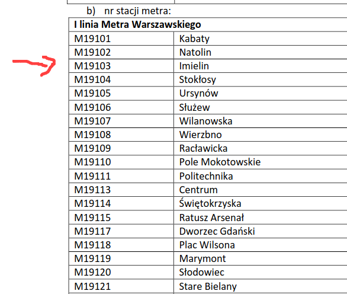

= Easy ticket validation 
:imagesdir: /matishadowblog/easy-ticket-validation

== Intro

Continuing the 
https://matishadow.github.io/matishadowblog/posts/hacking-buttons/[series] 
of stupid things in the real world, today we'll take a look 
at transportation in Warsaw.
And how ticket validation works for this service.

In short - it sucks.
After you buy a ticket on your phone, 
you have to scan a QR code **within 20 seconds**.
If you fail to find the QR code on the station,
the app crashes, or your phone lags, tough luck 
- **you're blocked for 3 minutes**.
Maybe you can buy another ticket and try again?
Nope, you're blocked for 3 minutes for all your tickets.

Why it works like this?
I don't even want to think about it.
It's probably some legacy security measurement
to help ticket inspectors, I don't care.

What I care about is how I can improve the experience 
for myself.

== Recon 

Let's start with scanning one of the QR codes,
and see what's the data behind it.

image::bramka.jpg[width=80%]

After scanning it we can find the following text:

[source]
----
WTPWarszawa_M19103
----

What do you do when you find a random piece of data?
You google it.

After checking the results,
I've found this PDF from the Warsaw Transport company:

https://www.ztm.waw.pl/wp-content/uploads/2021/03/Za%C5%82%C4%85czniki-do-umowy-sprzeda%C5%BCy_wz%C3%B3r-1.4.pdf

It contains all the code for all the stations.

So jackpot I guess.
Now we can generate the QR codes for all the stations,
and have them at hand to validate.

== Second device?

But even if we generate all the QR codes,
we need some way to display them.

I could print them out, but that's too much hassle.

So let's think of another device I could have at hand with me.

Maybe my Kindle would do, but it's not really pocket size,
and I'd prefer not to switch between QR codes and books.

Then I thought about my Flipper Zero (tamagochi for hackers),
which I've bought recently.

== QR codes on Flipper Zero 

After another quick search in Google,
I've found this library for generating 
the QR codes on the Flipper.

https://github.com/bmatcuk/flipperzero-qrcode

It requires QR code data to be provided in the form
of a file with `.qrcode` extension.

.example.qrcode
[source]
----
Filetype: QRCode
Version: 0
Message: your content here
----

Cool, so let's write a quick Python script
to generate these files.

.QR Codes generation
[source,python]
----
code_names = {'M19101': 'Kabaty',
              'M19102': 'Natolin',
              'M19103': '0 Imielin',  # prepend 0 to make it appear at the top
              'M19104': 'Stoklosy',
              'M19105': 'Ursynow',
              'M19106': 'Sluzew',
              'M19107': '0 Wilanowska',  # prepend 0 to make it appear at the top
              'M19108': 'Wierzbno',
              'M19109': 'Raclawicka',
              'M19110': 'Pole Mokotowskie',
              'M19111': 'Politechnika',
              'M19113': 'Centrum',
              'M19114': 'Swietokrzyska',
              'M19115': 'Ratusz Arsenal',
              'M19117': 'Dworzec Gdanski',
              'M19118': 'Plac Wilsona',
              'M19119': 'Marymont',
              'M19120': 'Slodowiec',
              'M19121': 'Stare Bielany',
              'M19122': 'Wawrzyszew',
              'M19123': 'Mlociny'}

# example qr code:
# WTPWarszawa_M19123

file_first_line = 'Filetype: QRCode\n'
file_second_line = 'Version: 0\n'
file_message_prefix = 'Message: WTPWarszawa_'

for code, name in code_names.items():
    f = open('qrcodes/' + name + '.qrcode', "w")

    f.write(file_first_line)
    f.write(file_second_line)
    f.write(file_message_prefix + code)

    f.close()
----

image::22.png[]

Now, let's transfer them to the device.

image::11.png[]
image::33.png[]

And run it on the Flipper.

image::3.jpg[]
image::4.jpg[]
image::5.jpg[]

== Testing the validation

video::demo-qr.mp4[width=760]